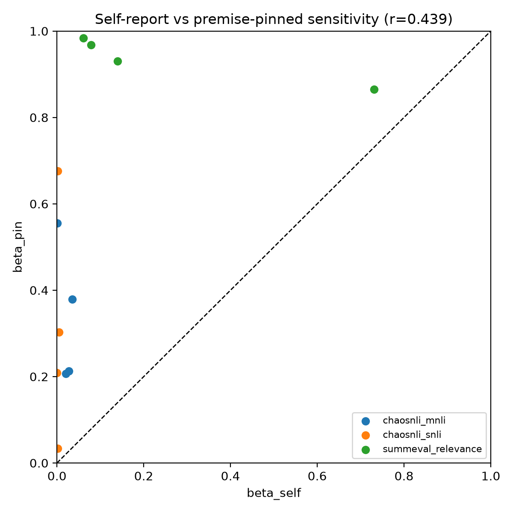
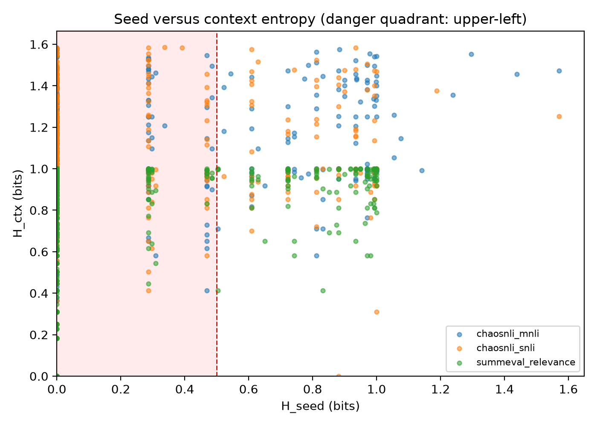
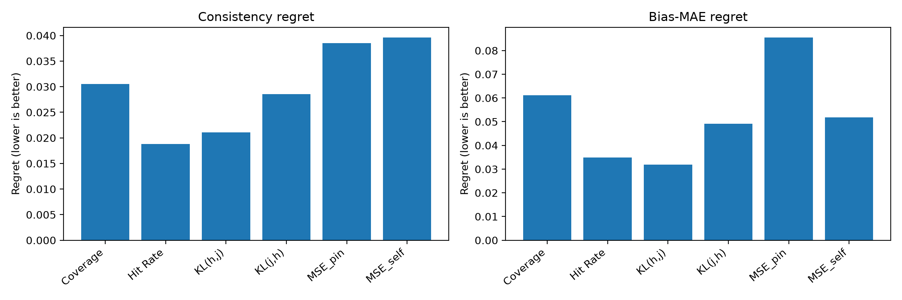

# Premise-Pinned Response Sets

Premise-Pinned Response Sets (PPRS) is a black-box method for detecting judge
rating sensitivity that ordinary resampling can miss. A judge first surfaces
unstated scoring premises; each premise is then counterfactually pinned to one
candidate value at a time, and the resulting discrete rating labels form a
response set.

The study is complete: preregistration, pilot, leakage audit, smoke run, frozen
full run, analysis, figures, hostile audits, and reproducibility materials have
all been produced.

## Key Results

| Hypothesis | Result | Decision |
|---|---|---|
| H1: `corr(beta_self, beta_pin) < 0.4` | `r=0.439`, 95% CI `[0.306, 0.871]` | Not supported |
| H2: dangerous-quadrant mass >15% | **80.69%**, 95% CI `[78.72%, 82.63%]` | Strongly supported |
| H3: PPRS is better on all tasks | SNLI −0.327; MNLI +0.104; SummEval +0.595/+0.254 | Not supported overall |

The strongest finding is that low seed entropy does not imply rating
insensitivity: 1,429 of 1,771 valid temperature-0.7 item-judge cells had
`H_seed <= 0.5` and `H_ctx > 0`. Real-pin context entropy averaged 0.922 bits,
versus 0.190 for matched placebo.

PPRS was not a universal replacement for self-reported response sets. It helped
on MNLI and SummEval under parts of the locked `pi` surface, but over-covered on
SNLI as the human response-set threshold increased.

## Start Here

- [Detailed Chinese experiment notes](docs/brief/pprs-experiment-notes-zh.md)
- [Technical brief](docs/brief/technical-brief.md)
- [Outreach email draft](docs/brief/email-draft.md)
- [Binding proposal and implementation specification](开题报告-Premise-Pinned-Response-Sets-实施规格.md)
- [Frozen preregistration](docs/experiments/preregistration.md)
- [Deviations and amendments](docs/experiments/deviations.md)
- [WP1 upstream/SummEval evidence](docs/research/upstream-discretization.md)
- [Research roadmap](docs/plans/research-roadmap.md)
- [AI-native workflow](ai-native-workflow/AI-Native-Workflow.md)

## Figures

| Figure | Preview |
|---|---|
| `beta_self` vs `beta_pin` |  |
| Seed/context entropy |  |
| Judge-selection regret |  |

## Frozen Study Design

- Tasks: ChaosNLI-SNLI, ChaosNLI-MNLI, SummEval-Relevance
- Items: 150 per task
- Judges:
  - `gpt-5.4`
  - `gpt-4o-mini-2024-07-18`
  - `gemini-3.1-pro-preview`
  - `gemini-3.5-flash`
- Temperatures: 0 and 0.7
- Forced-choice repetitions: 20
- Self-reported response-set repetitions: 20
- Premise-disclosure repetitions: 3
- One-dimension pinning plus matched placebo
- Human response-set grid: `pi = 0.05, ..., 0.25`
- Downstream grid: `tau = 0.0, ..., 1.0`
- Both upstream-behavior and semantic-aligned SummEval polarity conventions

Frozen Git tags:

- `pprs-prereg-v1`
- `pprs-prereg-v2` — generation-budget amendment after failed smoke
- `pprs-prereg-v3` — deterministic seed-collision amendment

## Data and Artifact Scale

- Raw call records: 365,543
- Successfully parsed records: 350,505
- High-risk item-judge cells: 1,429
- Full-grid cells: 469 valid / 480 expected
- Complete regret surface: 1,320 rows

Large and restricted artifacts remain outside Git:

- source-dataset text;
- raw provider responses;
- Parquet caches;
- local service configuration;
- credentials.

The repository tracks schemas, configs, sample identities, prompt/rendering
code, analysis code, figures, notes, hashes, and manifests. This avoids
redistributing upstream or source-dataset material without permission.

## Development

Requires Python 3.12 and `uv`.

```powershell
uv sync --dev
uv run pytest
```

Prepare the locked local datasets:

```powershell
uv run python scripts\prepare_chaosnli.py `
  --task-config configs\tasks\chaosnli-snli.json `
  --task-config configs\tasks\chaosnli-mnli.json

uv run python scripts\prepare_summeval.py
```

Rebuild analysis from an authenticated raw-run manifest:

```powershell
uv run python scripts\run_confirmatory_analysis.py `
  --trusted-raw-manifest-sha256 4334926c6b755dee566484a1eab982a2d931967d2a7c378232ff7eb2ad268e90 `
  --trusted-raw-manifest-id 2268923de41d3d4cdeb1de5c95d60dd90147ec1f655b70d373b3079caddc9246

uv run python scripts\render_results.py
uv run python scripts\build_reproducibility.py
```

The final local reproducibility manifest is:

`artifacts/wp8/reproducibility-manifest.json`

## Interpretation Boundaries

This study demonstrates a measurable failure mode in a frozen three-task,
four-judge panel. It does **not** estimate deployment prevalence, prove that
model-disclosed premises equal human reasoning, or establish that PPRS is
universally better than direct self-report. SummEval has only eight human
ratings per item, and the Google service identifiers are call-time slugs rather
than dated immutable deployments.