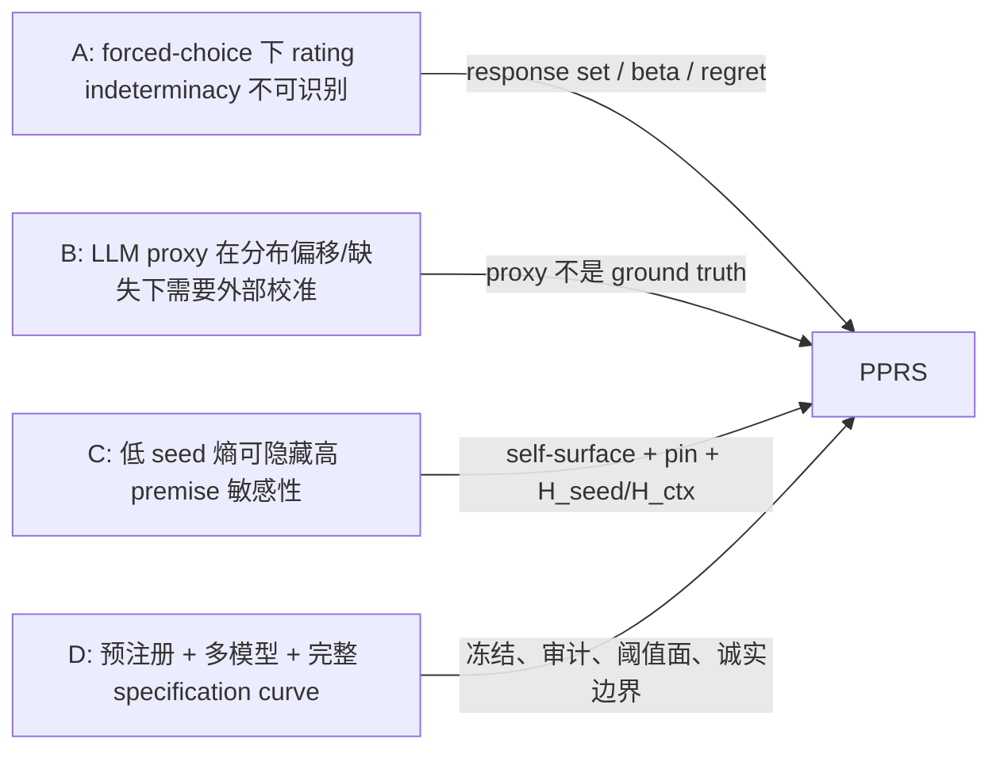

# Premise-Pinned Response Sets（PPRS）实验完整笔记

> 本文是一份面向项目复盘、科研沟通和后续写作的详细 notes。
> 冻结预注册：`pprs-prereg-v3`
> 原始记录：365,543 条
> 最终分析：`artifacts/wp7-full-v3/analysis.json`
> 复现清单：`artifacts/wp8/reproducibility-manifest.json`

---

## 0. 一页结论

本实验要回答两个问题：

1. LLM judge 在重采样下看起来很稳定时，是否仍会因为未言明的评分前提而改变评分？
2. 用前提钉住得到的 PPRS，是否比直接让模型自报 response set 更接近人工评分分布？

最终结论：

| 假设 | 预注册预测 | 结果 | 判定 |
|---|---|---|---|
| H1 | `corr(beta_self, beta_pin) < 0.4` | `r=0.439`，95% CI `[0.306, 0.871]` | 未支持 |
| H2 | 危险象限占比 >15% | 80.69%，95% CI `[78.72%, 82.63%]` | 强支持 |
| H3 | PPRS 在三个任务都优于 self-report，且优势随模糊度增加 | SNLI −0.327；MNLI +0.104；SummEval +0.595/+0.254 | 整体未支持 |

最准确的总结是：

> **PPRS 很强地发现了重采样稳定性看不到的前提敏感性；但“发现了前提敏感性”不等于“在所有任务上更接近人类分布”。**

这次实验最强的贡献是 **H2 的测量发现**，不是“PPRS 全面替代 self-report”。

---

## 1. 证据层级与阅读方式

本文区分三类陈述：

- **【项目锁定】**：来自开题报告、预注册、冻结配置的设计事实。
- **【外部论文】**：来自 A/B/C/D 论文解读的外部研究结论。
- **【本实验实证】**：来自最终 raw inventory、analysis、审计 supplement 的结果。

这一区分很重要。例如：

- “A 证明 forced choice 存在不可识别性”属于外部论文结论；
- “PPRS 的 H2 危险象限占比为 80.69%”属于本实验实证；
- “危险象限必须是低 `H_seed`、正 `H_ctx`”属于项目锁定定义。

---

## 2. 实验过程：从上游核验到最终报告

## 2.1 WP1：锁定上游与 SummEval 离散化

首先锁定论文 A 的代码仓库：

- 仓库：`lguerdan/indeterminacy`
- commit：`efdb3a2792369e2f98b86dd1d25c2f9c477c115a`
- `config/tasks.py` blob：`818b0aedb2281323f8440d8e0ddd8cbe0af50163`
- `config/prompts.py` blob：`ec4199372aa80355e249d39cd061af2eaa5d09fd`

核验得到：

- SummEval-Relevance 对 judge 展示的是二分类：
  - `A = Relevant`
  - `B = Not Relevant`
- response-set 空间为 `A`、`B`、`AB`。
- 公开处理数据实际把人工 1–5 分切成：
  - `relevance_0 = 1–3`
  - `relevance_1 = 4–5`

但上游存在极性冲突：

- prompt 中 option 0 / A 是 Relevant；
- 数据中 `relevance_0` 却是低分 1–3；
- 上游代码把 `relevance_0` 接到 option 0；
- 源码注释还错误写成 1–2 / 3–5。

因此没有偷偷选一个“看起来正确”的版本，而是冻结两条 SummEval
specification curve：

1. `upstream_behavior`：原样复刻公开代码行为；
2. `semantic_aligned`：4–5 对齐 Relevant，1–3 对齐 Not Relevant。

公开 run logs 的零 API 复算证明，论文 A 已发表的 SummEval 排名使用的是
`upstream_behavior` 约定。

相关文档：

- `docs/research/upstream-discretization.md`
- `docs/specs/wp1-upstream-and-data-evidence.md`

## 2.2 WP2：项目骨架、数据与 schema

建立了：

- Python 3.12 + `uv.lock`
- Pydantic schema
- Parquet raw-result schema
- run manifest / prompt ledger
- task/sample config
- 显式 parse failure 规则

固定样本：

| 任务 | 来源 | 数量 | 人工标签数 | seed |
|---|---|---:|---:|---:|
| ChaosNLI-SNLI | ChaosNLI SNLI | 150 | 100/条 | 42 |
| ChaosNLI-MNLI | ChaosNLI matched MNLI | 150 | 100/条 | 42 |
| SummEval-Relevance | SummEval | 150 | 8/条 | 42 |

每条数据保留 source revision、object ID、原始 ID、license/data-card
证据和有序 sample manifest。

## 2.3 WP3：provider、parser 与幂等缓存

实现了：

- 异步 LiteLLM provider；
- 本地 `ghc-api` OpenAI-compatible adapter；
- strict JSON parser；
- 每 cache key 一个原子 Parquet；
- 跨进程 file lock；
- raw text 永久保留；
- timeout/provider error/malformed/missing/refusal 显式记录；
- 非 `ok` 记录的 parsed 字段必须为空。

cache key 使用项目锁定的六个字段：

1. rendered prompt
2. model snapshot
3. temperature
4. `top_p`
5. seed
6. response format

没有默认标签、众数填充、哨兵标签或静默重试成功值。

## 2.4 WP4：prompt pilot 与泄漏审计

### 原始五个 prompt 版本

20 个条目 × 2 个模型 × 5 个措辞，共 200 cells。

| Template | 可钉住 / 40 | strict parse / 40 |
|---|---:|---:|
| inventory-v1 | 36 | 33 |
| boundary-v1 | 36 | 30 |
| counterfactual-v1 | 35 | 29 |
| rubric-v1 | 33 | 32 |
| minimal-v1 | 31 | 26 |

独立逐条 AI review 判定：

- 171/200（85.5%）至少包含一个真正可钉住的评分前提；
- 29/200 为任务复述、泛泛方法论、格式/工具维度或纯标签化输出。

原 pilot 的 50 条 parse failure 全部是 Gemini 的 fenced JSON，而不是内容
schema 崩坏。因此没有放宽 parser，而是创建新 ID：

`premise-disclosure-inventory-v2`

只增加格式约束：

- 首字符必须是 `{`
- 尾字符必须是 `}`
- 禁止 Markdown/code fence

聚焦复测：

- provider 返回 39 条；
- 39/39 strict parse；
- 38/39 含可用评分前提；
- 1 条是 transient provider no-choices error。

### 泄漏审计

使用不在被测 panel 内的 Microsoft-family
`mai-code-1-flash-picker`：

- 每任务 30 条；
- 共 90 条；
- static prompt 与 source item 分区；
- auditor 必须分别引用 static/source 原文证据。

最终：

| 任务 | Valid | Leakage false | Leakage true |
|---|---:|---:|---:|
| SNLI | 30 | 30 | 0 |
| MNLI | 30 | 30 | 0 |
| SummEval | 30 | 30 | 0 |

注意：59 条 rationale 较模板化，但 evidence quote 均被程序化验证。

## 2.5 WP5：预注册冻结与两次 amendment

冻结内容包括：

- H1/H2/H3；
- 三任务固定样本；
- 四模型 panel；
- F/S/P repetitions；
- 温度 0 与 0.7；
- `pi` 与 `tau` 全扫描；
- danger direction；
- placebo；
- option permutation；
- full-grid subset；
- leakage audit；
- SummEval 双极性；
- bootstrap 规则、tie-break、失败处理。

### v1 smoke 失败

首次 smoke：

- parse success 62.7%；
- 1,094 malformed 全来自 `gemini-3.5-flash`；
- 原因是 64/128/2048 completion budget 导致空或截断 JSON。

没有放宽 parser，也没有删除 Gemini，而是 Amendment 1：

- forced/pinned/placebo：1024 tokens
- response set：1024
- premise disclosure：8192
- F/S/pin/placebo/full-grid 使用新 v2 prompt ID
- 全部显式禁止 code fence

### v2 smoke 通过

- raw records：3,406
- parse success：96.54%
- planning errors：0
- 二跑 provider calls：0
- cache hit rate：100%

### v2 full run 在调用前停止

在第一条 full provider call 之前，发现两个坐标映射到同一个 31-bit seed。

Amendment 2：

- 非碰撞坐标 seed 完全不变；
- 仅碰撞时添加 deterministic nonce 后重哈希；
- v2 smoke 没有碰撞，因此无需重跑。

最终冻结 tag：

`pprs-prereg-v3`

## 2.6 WP7：全量运行

Panel：

| 模型 | Vendor | 层级 |
|---|---|---|
| `gpt-5.4` | OpenAI | strong/reasoning |
| `gpt-4o-mini-2024-07-18` | OpenAI | weak |
| `gemini-3.1-pro-preview` | Google | strong |
| `gemini-3.5-flash` | Google | weak |

完整运行：

- 450 items
- 4 judges
- 2 temperatures
- F：20 次
- S：20 次
- disclosure：3 次
- 每个 premise value 单独 pin
- 每个 real pin 配一个等长 placebo
- 20 items/task full-grid ablation

最终：

- raw records：365,543
- parsed `ok`：350,505
- 全部失败显式保留
- 主流程记录：
  - F：72,000
  - S：72,000
  - placebo：85,105
  - P/disclosure/pin：95,905
- full-grid：40,533

主流程 parse status：

| Status | Count |
|---|---:|
| ok | 313,035 |
| malformed_json | 2,662 |
| missing_field | 1 |
| provider_error | 9,300 |
| timeout | 12 |

---

## 3. 实验设计

## 3.1 三条主路径

### F：Forced Choice

- 每条目/模型/温度重采样 20 次；
- 得到强制单选分布；
- 计算 `H_seed`。

### S：Self-reported Response Set

- 直接要求 judge 选择所有合理选项；
- 每条目/模型/温度 20 次；
- 得到 per-option inclusion frequency；
- 构造 `beta_self` 与 `MSE_self`。

### P：Premise-Pinned

1. 让 judge 自曝未固定的评分前提；
2. 每个前提给 2–3 个候选值；
3. 每次只钉住一个前提维度的一个值；
4. 每个 pin 强制单选；
5. 所有有效 pin 标签并集形成 PPRS；
6. 分层边缘化 candidate value → premise → round，得到 `H_ctx`。

## 3.2 Placebo

每个 real pin 配一个：

- 句法相同；
- prompt 长度相同；
- 但钉住无关界面维度的 placebo。

因此 real 与 placebo 的差不能简单归因于：

- prompt 变长；
- 多调用一次；
- 额外出现一个“假设”句子。

## 3.3 两种熵

### Seed entropy

`H_seed` 是 F 路径 20 次评分标签的 Shannon entropy。

它回答：

> 同一 prompt 重采样时，judge 自己是否摇摆？

### Context entropy

`H_ctx` 是改变 judge 自己提出的评分前提后，pin 结果的分布熵。

它回答：

> judge 的评分是否依赖某个 prompt 未固定的 rubric 解释？

## 3.4 危险象限

锁定定义：

`H_seed <= 0.5 bit` 且 `H_ctx > 0`

即：

- 重采样下稳定；
- 看起来有信心；
- 但改变未言明前提会翻转评分。

高 `H_seed` 不属于危险象限，因为现有不确定性方法已经能看到它。

## 3.5 beta 指标

### `beta_self`

在 F 选择上游 negative option 的有效样本中，S 是否包含 positive option：

`P(positive in S | F = negative)`

### `beta_pin`

在同一批 negative F 样本中，该条目的 PPRS 是否包含 positive option：

`P(positive in PPRS | F = negative)`

NLI 的 positive/negative：

- positive = Entailment
- negative = Contradiction

SummEval：

- positive = Relevant
- negative = Not Relevant

Neutral 不进入 beta denominator。

## 3.6 人类 response set

ChaosNLI 每条 100 个标签。某选项的人工比例不低于 `pi` 时进入人工
response set。

完整扫描：

`pi = 0.05, 0.10, 0.15, 0.20, 0.25`

下游策略阈值：

`tau = 0.0, 0.1, ..., 1.0`

不选择一个有利点。

## 3.7 H3 loss

定义：

`Delta = MSE_self - MSE_pin`

- `Delta > 0`：PPRS 更接近人工 response set；
- `Delta < 0`：直接 self-report 更接近。

---

## 4. 实验结果

## 4.1 H1：self-report 与 pinning 的关系

结果：

- Pearson `r = 0.439`
- 95% bootstrap CI `[0.306, 0.871]`
- n = 12 task-judge cells

预注册预测是 `<0.4`，因此 H1 未支持。

但这不是“没有结果”：

- 它说明 A 的 self-report beta 与 pinning 并非完全不同构念；
- 两者至少有中等程度共同结构；
- CI 很宽，12 个 cell 的精度有限。

12 个 cell 的原始 beta：

| Task | Model | beta_self | beta_pin |
|---|---|---:|---:|
| SNLI | gpt-5.4 | 0.002 | 0.676 |
| SNLI | gpt-4o-mini-2024-07-18 | 0.005 | 0.302 |
| SNLI | gemini-3.1-pro-preview | 0.002 | 0.033 |
| SNLI | gemini-3.5-flash | 0.000 | 0.209 |
| MNLI | gpt-5.4 | 0.001 | 0.556 |
| MNLI | gpt-4o-mini-2024-07-18 | 0.035 | 0.379 |
| MNLI | gemini-3.1-pro-preview | 0.020 | 0.207 |
| MNLI | gemini-3.5-flash | 0.027 | 0.213 |
| SummEval | gpt-5.4 | 0.139 | 0.930 |
| SummEval | gpt-4o-mini-2024-07-18 | 0.731 | 0.865 |
| SummEval | gemini-3.1-pro-preview | 0.079 | 0.968 |
| SummEval | gemini-3.5-flash | 0.061 | 0.984 |

解释：

- 相关系数被明显的 task-level 结构影响；
- 绝对数值上，`beta_pin` 通常远高于 `beta_self`；
- 因此“有共同结构”与“pinning 暴露更多敏感性”可以同时成立。

## 4.2 H2：危险象限

主结果：

- 有效 cells：1,771/1,800
- 危险 cells：1,429
- 占比：80.69%
- 95% CI `[78.72%, 82.63%]`
- 预注册阈值：15%

H2 强支持且 bootstrap 稳健。

按任务：

| Task | Valid | Dangerous | Rate | Mean H_seed | Mean H_ctx |
|---|---:|---:|---:|---:|---:|
| SNLI | 593 | 500 | 84.32% | 0.156 | 0.991 |
| MNLI | 600 | 469 | 78.17% | 0.183 | 0.957 |
| SummEval | 578 | 460 | 79.58% | 0.178 | 0.815 |

按模型：

| Model | Valid | Dangerous | Rate | Mean H_seed | Mean H_ctx |
|---|---:|---:|---:|---:|---:|
| gemini-3.1-pro-preview | 445 | 397 | 89.21% | 0.108 | 0.877 |
| gemini-3.5-flash | 445 | 384 | 86.29% | 0.139 | 0.990 |
| gpt-5.4 | 450 | 350 | 77.78% | 0.217 | 1.015 |
| gpt-4o-mini-2024-07-18 | 431 | 298 | 69.14% | 0.226 | 0.803 |

温度 0 的危险比例仍为 79.90%，说明结果并非只由 temperature 0.7
采样噪声制造。

## 4.3 Placebo

| 指标 | Real pin | Placebo |
|---|---:|---:|
| Mean context entropy | 0.922 | 0.190 |

Matched real-minus-placebo flip contrast：

- `+0.2265`
- 95% CI `[0.2160, 0.2368]`
- valid pairs：39,457
- excluded：20

这表明大部分信号不能由“提示更长/多跑一次”解释。

## 4.4 H3：接近人工分布

完整 `pi` surface：

| pi | SNLI | MNLI | SummEval upstream | SummEval semantic |
|---:|---:|---:|---:|---:|
| 0.05 | +0.291 | +0.613 | +0.777 | +0.507 |
| 0.10 | −0.044 | +0.334 | +0.777 | +0.507 |
| 0.15 | −0.327 | +0.104 | +0.595 | +0.254 |
| 0.20 | −0.469 | −0.100 | +0.595 | +0.254 |
| 0.25 | −0.587 | −0.285 | +0.595 | +0.254 |

结论：

- 仅在 `pi=.05` 时，三个任务的点估计全部为正；SNLI 在 `pi=.10` 已转为
  −0.044；
- `pi` 增大后，NLI 的人工 response set 变窄，PPRS 容易过度覆盖；
- SummEval 在两种极性下都为正，但量级相差明显；
- 由于 SNLI 中位优势为负，H3 整体未支持。

这说明 PPRS 更像 **高召回的敏感性探测器**，不一定是所有任务上的最佳
人工 response-set 预测器。

## 4.5 Judge 选择 regret

对完整 `pi/tau/polarity` surface 做 task 等权平均：

| Metric | Consistency regret | Bias regret |
|---|---:|---:|
| Hit Rate | 0.0188 | 0.0349 |
| KL(h,j) | 0.0211 | 0.0319 |
| KL(j,h) | 0.0286 | 0.0491 |
| Coverage | 0.0305 | 0.0611 |
| MSE_pin | 0.0385 | 0.0855 |
| MSE_self | 0.0396 | 0.0518 |

注意：

- 这些是跨完整 specification surface 的平均；
- 不应只从单个阈值或任务得出“某 metric 永远最好”；
- 在该 panel 中，PPRS 的强检测能力没有自动转化为更低 judge-selection
  regret。

## 4.6 Full-grid 交互

预定 480 cells：

- 有效 469
- 排除 11
- failure rate 2.29%
- 11 个排除全部来自 SummEval

整体：

- mean `H_grid - H_ctx = +0.00244` bits
- mean PPRS Jaccard = 0.9549

说明：

- 一维逐次 pinning 得到的标签并集与全组合高度一致；
- 多前提交互对标签覆盖影响很小；
- 熵的权重和交互仍会带来少量差异。

## 4.7 数据质量与失败

所有 failures 均保留 raw text 和 metadata，没有填默认标签。

另有两组跨 primary/full-grid 的重复 seed：

- prompt、cache key、实验坐标均不同；
- 记录没有身份碰撞；
- 但不能声称所有生成随机性完全独立。

完整细节：

`artifacts/wp7-full-v3/audit-supplement.json`

---

## 5. 可视化图表

## 5.1 Figure 1：beta_self 与 beta_pin

读图：

- 横轴：`beta_self`
- 纵轴：`beta_pin`
- 虚线：二者相等
- 大多数点位于对角线上方，说明 pinning 暴露的 positive-in-set 概率通常
  更高；
- 但 task-level 排列使总体相关达到 0.439。

## 5.2 Figure 2：H_seed 与 H_ctx

读图：

- 横轴：`H_seed`
- 纵轴：`H_ctx`
- 左上区域是危险象限；
- 1,429 个 cells 被导出到：
  `artifacts/wp7-full-v3/figures/high-risk-items.json`

## 5.3 Figure 3：指标选型 regret

图中柱状值是先在 task 内平均完整 grid，再对 task 等权平均。

完整 1,320 行 surface：

`artifacts/wp7-full-v3/figures/regret-surface.csv`

不能只看聚合柱状图替代完整 surface。

---

## 6. 与论文 A 的关系：Rating Indeterminacy

## 6.1 A 的核心问题

【外部论文】A 研究：当一个条目存在多个合理评分时，forced choice 是否会
不可逆丢失信息，并导致错误 judge 排名。

A 的关键贡献：

- response-set 概率模型；
- forced-choice 不可识别性；
- `beta` 敏感度参数；
- 多标签 MSE 与 judge-selection regret；
- 指出 self-reported response set 的构念效度未验证。

## 6.2 PPRS 从 A 继承什么

- 离散 response-set 表示；
- F/S 两条基线；
- `beta` 结构；
- Hit Rate、双向 KL、Coverage、MSE；
- `pi/tau` surface；
- judge selection 与 downstream regret；
- SummEval-Relevance 二分类任务。

## 6.3 PPRS 增加什么

- 不直接相信 self-report；
- 让 judge 先自曝前提，再做反事实 pinning；
- 用 PPRS union 和 `H_ctx` 主动探测；
- ChaosNLI 提供真实群体标签分布；
- placebo、温度、选项顺序、泄漏和 full-grid 审计；
- SummEval 双极性 specification curve。

## 6.4 最终结果如何更新 A

H1 未支持意味着：

- 不能说 A 的 self-report beta 与 pinning 完全不同；
- 反而有有限的共享构念证据。

H2 强支持意味着：

- A/F/self-consistency 看见的低 seed entropy 不是“没有不确定性”；
- 大量质量藏在 unstated premise 轴上。

H3 失败意味着：

- PPRS 不是 self-report 的普遍替代品；
- 高敏感性集合可能在低歧义任务中产生过度覆盖。

因此对 A 的最稳健更新是：

> self-report 不是完全失效，但它系统性遗漏了一类可通过前提干预暴露的
> 敏感性；PPRS 更适合诊断，不一定总是更好的人工分布预测器。

---

## 7. 与论文 B 的关系：Doubly-Robust LLM-as-a-Judge

## 7.1 B 的核心问题

【外部论文】B 处理：

- 源评分样本与目标部署分布不同；
- 标注缺失非随机；
- persona LLM 是不完美代理；
- 如何通过 outcome model + reweighting 获得双重稳健估计。

## 7.2 共同认识论

B 与 PPRS 都反对：

> 把 LLM 输出直接当成人类真值。

共同点：

- LLM 输出是待验证 proxy；
- 需要外部人工分布；
- 模型内部稳定性不等于测量有效性；
- 必须显式写出识别假设和失败模式。

## 7.3 不同点

| B | PPRS |
|---|---|
| 目标总体外部效度 | 单条目 rubric 前提敏感性 |
| persona 辅助 outcome model | judge 自曝 premise |
| IPW/Riesz/cross-fitting | counterfactual pinning |
| attrition/distribution shift | ambiguity/vagueness/disagreement |
| 估计总体均值/区间 | 构造 response set 与二维熵 |

本实验没有使用或验证：

- DR estimator
- IPW
- Riesz loss
- demographic reweighting
- no-concept-drift / positivity / overlap

## 7.4 本结果对 B 的启示

H2 说明：

- 一个 proxy 即使重采样方差很低，也可能高度依赖隐含前提；
- 因而 proxy calibration 不应只看相关性和稳定性。

H3 的任务/阈值依赖说明：

- proxy quality 不能压成一个脱离任务和政策阈值的全局数字。

但本实验不能声称 PPRS 已解决 B 的外部效度问题。

---

## 8. 与论文 C 的关系：When Consensus Lies

## 8.1 C 的核心问题

【外部论文】C 研究：

- 多模型一致是否真的是独立证据；
- 还是共享信息边界造成的稳定共同误解。

C 将不确定性拆成：

- seed uncertainty
- context/premise uncertainty

并用：

1. assumption surfacing
2. counterfactual pinning
3. executable equivalence clustering

识别低 seed、高 context 的危险失败。

## 8.2 PPRS 直接迁移的机制

PPRS 的核心四步直接来自 C：

1. 自曝未言明前提；
2. 每次只钉一维；
3. 候选值下重新作答；
4. 比较 `H_seed` 与 `H_ctx`。

关键简化：

- C 需要可执行 checker 判断答案等价；
- PPRS 的评分标签天然离散；
- 标签相等即等价，不需要额外 LLM judge。

## 8.3 H2 是 C 机制的跨任务迁移与操作化改编

本实验把 C 的机制从：

- code/data/policy 可执行任务

扩展到：

- NLI 与摘要 relevance 评分任务。

80.69% 危险象限占比、real/placebo entropy 差和正 flip contrast 共同说明：

- 稳定但前提敏感的现象在评分任务中大量存在；
- 不是 prompt 变长造成的简单伪影。

## 8.4 H3 给 C 增加的限制

C 主要关心：

- 是否检测到 latent premise sensitivity。

PPRS 进一步问：

- 检测到的 sensitivity 是否更像人类分布。

H2 强而 H3 混合说明：

> **检测效度强，不代表人类分布对齐效度强。**

这是本项目相对 C 最重要的新边界。

## 8.5 不应声称

- 本项目没有 CD、ICC、`n_eff`；
- 没有 ambiguity gold，因此不报告 AUROC；
- 不证明模型前提等于人类真实理由；
- 不证明 pinning 会修正最终评分；
- H2 不是部署 prevalence。

---

## 9. 与论文 D 的关系：Don’t Crash-Test with Your Safest Driver

## 9.1 D 的核心问题

【外部论文】D 研究 synthetic-user 风险测量是否随 backend 改变，以及只用
“最强模型”是否漏掉高风险行为。

D 的方法学重点：

- 多 backend/panel；
- 分布而非单点；
- 阈值扫描；
- 预注册；
- 显式失败；
- 偏离记录；
- adverse/null 结果照报。

## 9.2 PPRS 继承和对齐的方法学

PPRS 从 D 直接继承的核心不是一个公式，而是以下研究纪律：

- prereg v1/v2/v3；
- parse failure 显式为空；
- complete `pi/tau` surfaces；
- H1/H3 失败照实报告；
- 每次 amendment 保留旧 tag 和失败缓存。

以下设计与 D 的方法学精神一致，但属于 PPRS 针对自身问题新增的治理措施，
不应写成 D 原文直接规定：

- smoke 不通过不得 full；
- placebo 与 temperature ablation；
- model/service caveat；
- SummEval polarity specification curve；
- option permutation 和 premise leakage audit。

## 9.3 过程中的具体体现

- v1 smoke 62.7%：停止，未跑 full；
- 修改 token budget 时创建新 prompt ID；
- full seed collision 在首个调用前停止；
- v3 才进入全量；
- 11 个 full-grid exclusions 全部列出；
- 29 个 H2 cells 排除，不填成 0；
- 两组 seed 重复写入 audit supplement。

## 9.4 结果对 D 的呼应

危险比例按模型从 69.1% 到 89.2%，说明测量结果确实有 backend 依赖。

但不能把它直接解释成：

- 哪个模型“最危险”；
- 哪个模型“最安全”；
- 能力越强越怎样。

四模型样本太窄，而且这里测的是 premise sensitivity，不是 D 的 synthetic-user
采纳风险。

H3 的 `pi` 翻转尤其说明为什么 D 式 specification curve 必须保留：

- 只报 `pi=.05`，会得到“PPRS 全面改善”；
- 只报 `pi=.25`，会得到“NLI 上 PPRS 明显更差”。

选择单点会产生完全不同的故事。

---

## 10. A/B/C/D 与 PPRS 的综合地图

一句话概括：

- A 给出问题空间与比较基线；
- B 提醒“模型输出只是代理”；
- C 给出主动探测隐含前提的机制；
- D 给出防止研究者自欺的实验治理方式；
- PPRS 把四者接到同一个离散评分实验中。

---

## 11. 局限与后续问题

1. **人工 response set 并未直接观测。** ChaosNLI 是群体标签分布，不是同一
   评分者的多选集合。
2. **前提构念未独立验证。** 模型说的 premise 是否等于人类真正依据，尚未知。
3. **Google service slug 可漂移。** `/models` roster 被哈希，但不是模型权重证明。
4. **SummEval 只有 8 标签/条。** 分布估计远弱于 ChaosNLI。
5. **任务和模型都窄。** 不能外推到全部 judge 或部署场景。
6. **PPRS 有过度覆盖风险。** SNLI 高 `pi` 下表现明显变差。
7. **两组 seed 重复。** prompt/cache 坐标不同，但不能声称所有随机流完全独立。
8. **Pilot/smoke 逐条 review 是 owner 预授权下的 AI review。** 不应描述为人类
   owner 已逐条复核。

最值得继续做的研究：

- 真实人类多标签 response-set 标注；
- 人类理由与模型 premise 的语义对齐；
- 学习何时使用 PPRS、何时使用 self-report；
- 将 PPRS 从 union 改为校准的 soft inclusion probability；
- 对 `pi` 敏感性建立任务自适应或决策理论解释；
- 扩展到 pairwise preference、连续评分和专家领域。

---

## 12. 产物地图

| 产物 | 路径 |
|---|---|
| 冻结预注册 | `docs/experiments/preregistration.md` |
| 偏离日志 | `docs/experiments/deviations.md` |
| Pilot review | `docs/experiments/wp4-pilot-review.md` |
| Leakage audit | `docs/experiments/wp4-leakage-audit.md` |
| Raw manifest | `artifacts/wp7-full-v3/run-manifest.json` |
| Raw inventory | `artifacts/wp7-full-v3/raw-records.jsonl` |
| Prompt ledger | `artifacts/wp7-full-v3/prompt-ledger.json` |
| Combined analysis | `artifacts/wp7-full-v3/analysis.json` |
| Upstream polarity analysis | `artifacts/wp7-full-v3/analysis-upstream_behavior.json` |
| Semantic polarity analysis | `artifacts/wp7-full-v3/analysis-semantic_aligned.json` |
| Audit supplement | `artifacts/wp7-full-v3/audit-supplement.json` |
| Figure 1 | `artifacts/wp7-full-v3/figures/figure-1-beta-scatter.png` |
| Figure 2 | `artifacts/wp7-full-v3/figures/figure-2-seed-context-entropy.png` |
| Figure 3 | `artifacts/wp7-full-v3/figures/figure-3-regret.png` |
| Regret surface | `artifacts/wp7-full-v3/figures/regret-surface.csv` |
| High-risk list | `artifacts/wp7-full-v3/figures/high-risk-items.json` |
| Repro manifest | `artifacts/wp8/reproducibility-manifest.json` |
| 技术简报 | `docs/brief/technical-brief.md` |
| 邮件稿 | `docs/brief/email-draft.md` |

---

## 13. 最终可对外表述

推荐：

> 在冻结的三任务、四 judge panel 中，premise pinning 暴露了大量重采样
> 稳定性无法发现的评分敏感性：80.69% 的有效 item-judge cells 位于低
> `H_seed`、正 `H_ctx` 的危险象限。真实 pin 的平均上下文熵为 0.922，
> placebo 为 0.190；另一个预注册 matched flip contrast 的 95% CI 不含 0。
> 但 PPRS 并非普遍更接近人工分布：在锁定 `pi` 网格的中位点上，MNLI
> 点估计为 +0.104，但 95% CI `[-0.004, 0.213]` 跨 0；SummEval 为正，
> SNLI 则出现过度覆盖。MNLI 在 `pi=.20/.25` 时也转为负值。因此 PPRS
> 更适合作为主动敏感性诊断工具，而不是无需校准的 self-report 替代品。

不推荐：

- “PPRS 在所有任务上优于 self-report。”
- “80.69% 的真实部署判断都有风险。”
- “模型自曝前提就是人类真实理由。”
- “某个模型最安全/最危险。”
- “SummEval 极性问题已经被作者确认修复。”
