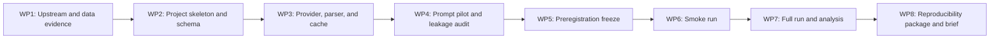

# PPRS Research Roadmap

## Purpose

This roadmap operationalizes the binding proposal specification. It is a dependency-ordered plan, not a replacement for the proposal: implementation may not change locked values without an approved entry in `docs/experiments/deviations.md`.

## Dependency Graph

## Work Packages

| ID | Objective | Inputs | Deliverables | Acceptance gate | Dependencies |
|---|---|---|---|---|---|
| WP1 | Establish lawful, comparable task definitions | Proposal; pinned upstream repositories; data cards | `docs/research/upstream-discretization.md`, data provenance record | SummEval option discretization matches the pinned indeterminacy commit; ChaosNLI sampling frame and licenses are recorded | None |
| WP2 | Make the experiment executable and auditable | WP1 evidence; locked schema | Python project, lock file, task configs, Parquet schema, run manifest format | Three task option spaces are committed; schema includes every proposal result field | WP1 |
| WP3 | Implement robust data collection | WP2 schema | async LiteLLM provider, mock provider, parser, idempotent Parquet cache | Tests prove cache-key idempotence and prove malformed JSON, missing fields, and timeouts remain explicit null failures | WP2 |
| WP4 | Validate PPRS elicitation before preregistration | WP3; 20 items x 2 models | prompt variants, human review record, placebo prompt, leakage-audit protocol | Most reviewed self-reports yield pin-able scoring premises; leakage auditor examines 30 items per task with an out-of-panel model | WP3 |
| WP5 | Freeze confirmatory analysis | WP4 output; proposal | preregistration document, config hash, git tag, deviations log | H1-H3, $\pi$/$\tau$ scans, dangerous quadrant and three primary figures are fixed in a signed commit | WP4 |
| WP6 | Demonstrate end-to-end reliability | WP5; 10 items x 2 models | smoke Parquet, cache report, audit sample | Parse success is at least 95%; rerun cache hit rate is 100%; 20 sampled records show no silent imputation | WP5 |
| WP7 | Run the locked study and calculate results | WP6; four snapshot-pinned judges | raw Parquet, derived tables, three figures, high-risk-item list | All figures rebuild from raw Parquet; analyses scan all locked thresholds and preserve task-specific human-reference caveats | WP6 |
| WP8 | Produce an honest handoff | WP7 | reproducibility manifest, four-page technical brief, email materials | A clean environment rebuilds figures; brief states data, snapshot, construct-validity and generalization limits | WP7 |

## Slice Boundaries

1. WP1 is documentation-only and must finish before task configuration is written.
2. WP2 and WP3 are a serial contract: the raw schema and cache-key identity are shared infrastructure.
3. Prompt variants within WP4 may be explored in parallel only after their common record schema is fixed; the final chosen wording requires a single documented decision.
4. WP5 is a hard stop. No full-run parameters may drift afterward without a deviation entry and owner approval.
5. Data collection, analysis, and report rendering can use separate worktrees after WP5, but analysis may consume only manifest-listed raw datasets.

## Non-Negotiable Audits

- **Data provenance:** Every item retains its source dataset, split, original ID, license/data-card source, and sampling seed.
- **Identity coverage:** Cache and dataset identities include every output-affecting field. Auditors mutate one field at a time to confirm a cache miss occurs.
- **Failure behavior:** Non-`ok` parsing preserves `raw_text` and error metadata while keeping parsed fields null; add a regression test for each failure type.
- **Measurement direction:** Assert in analysis tests that high-risk means low $H_{seed}$ plus positive $H_{ctx}$, never the inverse.
- **Threshold robustness:** Report the complete $\pi$ and $\tau$ scan surfaces, not a selected point estimate.
- **Leakage and placebo:** The auditor is outside the measured judge panel; placebo results are reported even if they weaken the claim.
- **Rebuildability:** A fresh environment derives figures from raw Parquet and a run manifest without hand editing.

## Required Planning Artifacts

Before each work package begins, create `docs/specs/<wp-id>-<slug>.md` with Objective, Non-goals, Interfaces, Data/License constraints, Acceptance Criteria, Test/Audit Evidence, and Deviations. Create a corresponding `docs/plans/<wp-id>-<slug>.md` with commands, checkpoints, rollback behavior, and the specific independent-audit prompt.

## Stop Conditions

- Stop and request a decision when an upstream repository's SummEval discretization cannot be established exactly.
- Stop before collecting external-model outputs if model snapshots, credentials policy, or data license status remains unknown.
- Stop before the full run if WP6 fails any acceptance gate; repair the exact failure and rerun the smoke test.
- Stop before publication or public release if upstream license/permission review is unresolved.