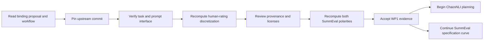

# WP1 Plan: Upstream and Data Evidence

## Scope and Dependency

WP1 is documentation-only and has no predecessor. The owner accepted a split
dependency boundary: ChaosNLI planning may proceed after the upstream and data
evidence is accepted, while the SummEval polarity specification curve continues
as a parallel branch.



## Commands and Evidence Procedure

All commands are read-only with respect to upstream repositories. Temporary
source data may be downloaded only outside the git worktree for verification.

1. Confirm repository state without changing branches:

   ```powershell
   git --no-pager status --short --branch
   ```

2. Resolve and record the immutable upstream identity:

   ```powershell
   gh api repos/lguerdan/indeterminacy
   gh api repos/lguerdan/indeterminacy/commits/main
   gh api repos/lguerdan/indeterminacy/git/ref/heads/main
   ```

3. Fetch only the required files at the full SHA and record their blob SHAs:

   ```powershell
   gh api "repos/lguerdan/indeterminacy/contents/config/tasks.py?ref=<FULL_SHA>"
   gh api "repos/lguerdan/indeterminacy/contents/config/prompts.py?ref=<FULL_SHA>"
   ```

4. Verify history and license state:

   ```powershell
   gh api "repos/lguerdan/indeterminacy/commits?path=config/tasks.py&per_page=100"
   gh api "repos/lguerdan/indeterminacy/commits?path=config/prompts.py&per_page=100"
   gh api repos/lguerdan/indeterminacy/license
   gh api repos/lguerdan/indeterminacy/contents
   ```

5. Pin the upstream data snapshot by Hugging Face revision and object ID. Compare
   the official SummEval annotation file with
   `SummEval/summ_eval_processed.csv`. For each dimension and row, count both
   candidate splits (`1--2`/`3--5` and `1--3`/`4--5`) and require a complete
   match before stating the transformation.

6. Record evidence, retrieval date, conclusion, and caveat in
   `docs/research/upstream-discretization.md`.

7. Load the immutable published `main-run` logs without invoking a provider.
   At beta 0 and tau 0.5, compute judge metrics with the human columns unchanged
   and with `_0`/`_1` swapped. Compare the selected judge and downstream-bias
   ranking with the published paper analysis.

No command in WP1 may call a model provider, create experiment outputs, alter a
locked parameter, or run a full dataset experiment. The row-level
discretization check is provenance verification, not an experiment.

## Checkpoints

| Checkpoint | Required evidence | Gate |
|---|---|---|
| C1: proposal boundary | All three governance documents read | No external claim treated as a project fact |
| C2: commit pin | Full SHA, date, parent, tree, target blob SHAs | No branch-name references in implementation |
| C3: option interface | Task config and prompt agree on binary tokens | Record any semantic mismatch |
| C4: data transformation | All 1,600 rows compatible with one threshold | No inferred threshold from samples |
| C5: compliance | Repository and source-dataset terms recorded | No code copying or public-release claim |
| C6: owner decision | Both polarity mappings required as a specification curve | No silent relabeling |
| C7: published-run reproduction | Upstream qualitative ranking reproduced only under unchanged columns | Actual paper convention established |
| C8: split handoff | ChaosNLI planning unblocked; SummEval remains parallel | No model calls or full runs |

## Rollback and Stop Behavior

- Documentation edits can be reverted as one uncommitted WP1 change set.
- Temporary downloaded files remain outside the repository and are not
  deliverables.
- If the exact discretization cannot be established, stop and request owner
  guidance.
- If code, comments, prompts, and published data disagree, record each fact and
  report both owner-approved conventions.
- Do not add a submodule or SummEval task config before both mappings are
  represented in the implementation plan.

## Independent Audit Prompt

```text
You are an independent hostile auditor for PPRS WP1. Read the binding proposal,
the WP1 spec, plan, and research record. Treat every conclusion as untrusted.
Using only the cited immutable GitHub commits/blobs, Hugging Face revisions, and
official dataset sources, independently verify:
1. the pinned lguerdan/indeterminacy commit and target blob identities;
2. the SummEval-Relevance FC/RS option semantics;
3. whether all 1,600 processed rows use 1--3 versus 4--5, rather than the source
   comment's 1--2 versus 3--5;
4. whether unchanged public columns reproduce the paper's reported
   SummEval-Relevance ranking and swapped columns do not;
5. whether the plan preserves both polarities as a specification curve;
6. whether any license statement overclaims permission.
Do not modify files. Report ranked BLOCKER/MAJOR/MINOR/UNVERIFIED findings with
source URLs, exact evidence, and an explicit PASS/FAIL verdict.
```

## Completion and Handoff

WP1 evidence is complete after the owner decision and published-run
reproduction. The next permitted work is ChaosNLI spec/plan preparation plus
the parallel SummEval specification-curve design. Model calls and full
experiments remain prohibited until their later gates.
