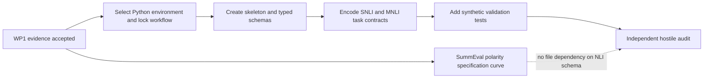

# WP2 Plan: Project Skeleton and Schema

## Dependency and Slice Plan

WP2 begins with the owner-approved ChaosNLI path while SummEval polarity analysis
continues independently.



Slices are serial because project metadata, schemas, task configs, and tests
share the same contracts. The SummEval evidence branch may proceed in parallel
only where it does not edit these files.

## Decision Checkpoint: Python Tooling

The owner selected:

- Python 3.12;
- `uv` 0.12.1;
- `pyproject.toml`;
- `uv.lock`;
- `uv sync --dev` for environment restoration;
- `uv run pytest` for the offline test suite.

This workflow provides:

- `pyproject.toml`;
- deterministic dependency locking on Windows;
- Python environment creation;
- test execution;
- no dependency on provider credentials.

The exact commands are:

```powershell
uv sync --dev
uv run pytest
```

Do not claim build/test gates until those commands have run successfully.

## Planned Files

| Path | Purpose |
|---|---|
| `pyproject.toml` | Package metadata, Python constraint, dependencies, tests |
| lock file | Exact resolved dependencies |
| `src/pprs/data/schema.py` | Dataset and human-label contracts |
| `src/pprs/records/schema.py` | Raw-result contract and parse-status rules |
| `src/pprs/manifests/schema.py` | Run identity and manifest hashing |
| `configs/tasks/chaosnli-snli.*` | Locked SNLI task definition |
| `configs/tasks/chaosnli-mnli.*` | Locked MNLI task definition |
| `configs/tasks/summeval-relevance.*` | Binary options and dual polarity conventions |
| `tests/data/` | Synthetic provenance and label-count tests |
| `tests/records/` | Explicit failure/nullability tests |
| `tests/manifests/` | Identity-dimension mutation tests |

The serialization format for task configs must be selected once and used
consistently. No final dataset sample list is created in this slice.

## Execution Steps

1. **Environment and metadata**
   - use Python 3.12 and the owner-approved `uv` workflow;
   - create package metadata and lock dependencies;
   - document build and test commands.

2. **Typed enums and primitives**
   - define task IDs, paths, parse statuses, and premise types;
   - define semantic option objects separately from transport tokens;
   - reject aliases or defaults that can hide unknown values.

3. **Dataset schema**
   - encode immutable source revision, split, original ID, label counts,
     normalized distribution, license source, and sampling seed;
   - validate exactly 100 labels for ChaosNLI records;
   - keep raw counts authoritative and derive normalized distributions.

4. **NLI task configs**
   - SNLI source: ChaosNLI SNLI only, sample size 150, seed 42;
   - MNLI source: ChaosNLI matched MNLI only, sample size 150, seed 42;
   - option order `A/E`, `B/N`, `C/C`;
   - response-set tokens fixed to seven non-empty subsets;
   - include pinned upstream commit/blob references.

5. **Raw-result schema**
   - implement all proposal fields and explicit nullable types;
   - enforce the six parse statuses;
   - reject parsed payloads when status is not `ok`.

6. **Manifest identity**
   - canonicalize and hash every output-affecting field;
   - include an explicit model-snapshot-to-provider mapping,
     dataset/config/template hashes, the rendered prompt ledger hash, and
     option-permutation seed;
   - give each SummEval polarity a distinct analysis manifest and output
     location, joined by a specification-curve manifest.

7. **Synthetic tests**
   - add positive fixtures for SNLI and MNLI;
   - mutate one field at a time for negative and identity tests;
   - prohibit network access and model/provider imports in the test slice.

8. **Documentation handoff**
   - update repository status and exact commands;
   - list unresolved items: model snapshots and the later SummEval
     specification-curve execution.

## Checkpoints

| Checkpoint | Gate |
|---|---|
| Tooling selected | Exact Python, lock, build, and test commands recorded |
| Schema fixed | All proposal raw-result fields represented |
| NLI configs fixed | E/N/C order, 150-item counts, and 100-label source enforced |
| Identity audit | One-field mutations change manifest identity |
| Failure audit | Non-`ok` parsed fields cannot be populated |
| Offline audit | Tests complete without network or credentials |

## Rollback Behavior

- Project metadata and lock file are one atomic change.
- Schemas land before task configs; configs must not contain duplicated schema
  logic.
- If the chosen dependency workflow cannot lock deterministically on Windows,
  revert only the metadata/lock slice and select another ecosystem tool.
- If a proposal field cannot be represented without ambiguity, stop and request
  owner guidance rather than narrowing or renaming it silently.
- No raw data, provider output, credential, or generated Parquet file may enter
  Git.

## Independent Audit Prompt

```text
You are an independent hostile auditor for PPRS WP2. Read the binding proposal,
WP1 evidence, and the WP2 spec/plan. Treat the implementation and tests as
untrusted. Do not modify files.

Verify:
1. SNLI and MNLI can only be sourced from ChaosNLI and retain official IDs,
   revision, split, license source, seed, and all 100 human labels;
2. option order is exactly A=Entailment, B=Neutral, C=Contradiction everywhere;
3. every proposal raw-result field exists with correct nullability;
4. non-ok parse states cannot carry parsed values;
5. manifest identity changes when any output-affecting field changes;
6. SummEval polarity conventions can coexist without cache or analysis-key
   collision;
7. tests and imports make no network or provider calls.

Report ranked BLOCKER/MAJOR/MINOR/UNVERIFIED findings with file:line evidence and
an explicit PASS/FAIL verdict.
```

## Stop Point

After writing this spec and plan, stop for owner confirmation of the Python
tooling choice and file contract before creating the executable skeleton.
