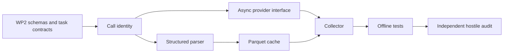

# WP3 Plan: Provider, Parser, and Cache

## Dependency Graph



These slices are serial because the collector depends on the shared request,
parse-result, and raw-record contracts.

## Files

| Path | Purpose |
|---|---|
| `src/pprs/providers/base.py` | Provider request/result and typed failures |
| `src/pprs/providers/mock.py` | Deterministic offline provider |
| `src/pprs/providers/litellm.py` | Async LiteLLM adapter, unused in tests |
| `src/pprs/parsing.py` | Strict format-specific JSON parsing |
| `src/pprs/cache.py` | Idempotent Parquet record cache |
| `src/pprs/collector.py` | Cache/provider/parser orchestration |
| `tests/providers/` | Mock and adapter-contract tests |
| `tests/test_parsing.py` | Parser success/failure matrix |
| `tests/test_cache.py` | Identity, collision, and concurrency tests |
| `tests/test_collector.py` | End-to-end offline collection tests |

## Execution Steps

1. Add LiteLLM as a runtime dependency without configuring credentials.
2. Define immutable call identity and canonical hashing.
3. Implement strict Pydantic payload models and error classification.
4. Implement one-record-per-key Parquet storage using the WP2 Arrow schema.
5. Implement async mock provider with invocation counting and programmable
   timeout/error outcomes.
6. Implement the collector and explicit failure conversion.
7. Add targeted offline tests, then run the full suite.
8. Run a fresh hostile audit focused on silent failure and identity collision.

## Commands

```powershell
uv lock
uv sync --dev
uv run pytest
```

No command may contact a model provider during WP3.

## Checkpoints

| Checkpoint | Gate |
|---|---|
| Identity fixed | Six one-field mutations yield six cache misses |
| Parser fixed | Every failure has explicit status and null parsed fields |
| Cache fixed | Identical rerun is a no-op; collision raises |
| Collector fixed | Timeout/provider errors are durable raw records |
| Concurrency fixed | Identical concurrent calls invoke provider once |
| Audit fixed | Independent reviewer reports no high-confidence issue |

## Rollback Behavior

- Dependency changes and lock update are one atomic slice.
- Parser failures never trigger fallback values.
- Cache collision is fatal and leaves the existing record untouched.
- A failed Parquet write leaves only an ignored temporary file, which is safe to
  remove and never counts as a cache hit.
- If LiteLLM cannot be imported without credentials, keep the adapter lazily
  importing it inside the call method.

## Independent Audit Prompt

```text
Audit PPRS WP3 read-only. Treat provider, parser, cache, collector, and tests as
untrusted. Verify the cache key contains exactly rendered prompt, model
snapshot, temperature, top_p, seed, and response format; mutate each field.
Attack malformed/missing/duplicate/unknown JSON payloads, timeout and provider
errors, cache collision, concurrent duplicate calls, partial files, and raw-text
preservation. Confirm non-ok records have null parsed fields and no real network
or provider call occurs in tests. Report ranked findings and PASS/FAIL.
```
