# WP4 Plan: Prompt Pilot and Leakage Audit

## Dependency Graph

```mermaid
flowchart LR
  A[WP3 provider/parser/cache] --> B[Offline prompt registry]
  B --> C[Leakage and permutation tests]
  C --> D[Independent offline audit]
  D --> E[Owner approves model/provider snapshots]
  E --> F[20 items x 2 models pilot]
  F --> G[Human review and wording decision]
  G --> H[30 items/task leakage audit]
  H --> I[WP5 preregistration]
```



## Offline Files

| Path | Purpose |
|---|---|
| `src/pprs/prompts.py` | Prompt registry and renderers |
| `configs/prompts/task-framings.json` | Label-free criteria and forbidden labels |
| `tests/test_prompts.py` | Leakage, permutation, syntax, and format tests |

## Offline Steps

1. Encode five premise-disclosure candidates.
2. Encode label-free SNLI, MNLI, and SummEval criteria.
3. Implement deterministic option permutation and rendering.
4. Implement F, S, disclosure, pinned, and placebo prompts.
5. Implement lexical leakage reports separating framing/criterion from source
   item content.
6. Run the complete offline suite and independent audit.

## Later Pilot Steps

Blocked until explicit provider/model snapshot approval:

1. select 20 items shared across two approved models;
2. run 4--5 disclosure variants at the pilot settings;
3. manually classify every output as pin-able premise, task restatement,
   generic methodology, formatting/tooling, malformed, or refusal;
4. choose one wording using the review record, not aggregate convenience;
5. keep all variant results and adverse findings.

## Leakage Audit

- sample 30 items per task;
- use an out-of-panel cross-family auditor;
- give the auditor the disclosure prompt and source item, but no measured judge
  output;
- ask whether the prompt introduces an answer axis, option label, or directional
  hint beyond source content;
- preserve the auditor raw text and human adjudication.

## Rollback and Stop Behavior

- Prompt candidate edits are versioned; IDs are never reused.
- A rejected candidate remains in the review record.
- If most outputs are not pin-able, stop before preregistration and report the
  failure rather than narrowing the prompt until it leaks the answer axis.
- If `ghc-api` integration requires output-affecting parameters absent from the
  WP3 cache identity, stop and amend the identity contract before calls.

## Independent Audit Prompt

```text
Audit PPRS WP4 offline prompt assets read-only. Treat every prompt as potentially
leaky. Verify disclosure framing and task criteria contain no option labels or
tokens; disclosure never asks for an answer; each premise has 2-3 values and one
allowed type; pinning resolves exactly one dimension/value; option permutation
is deterministic and complete; placebo uses the same syntax but an irrelevant
dimension; prompt IDs and hashes are stable; no provider call occurs. Report
ranked findings and PASS/FAIL.
```
